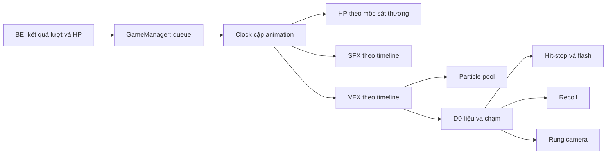

# Phân tích video và áp dụng cảm giác va chạm vào ZeroSpace

Video tham chiếu: `SnapSave.to_AQMlVAX-7oWRpp5VGa-se5wz6Jy0kfqWLF-LuHTV0bXuzV061kbdCn72QuXkj4c68OAcwDQZNw5DhWyuD4F2RI-V8QAdabLTi6rronQO_6V0yw_720p_(HD).mp4`, tại `D:/Dowload_D`.
Đã xem toàn bộ 49,15 giây qua khung hình mỗi giây và các dải khung hình dày hơn ở từng ví dụ. Video có kích thước 720 × 1280, 30 fps, gồm gameplay, chữ giải thích và các đoạn chuyển cảnh.

## Ý chính của video

Cảm giác một đòn đánh có lực hình thành khi nhiều phản hồi cùng xuất hiện tại điểm chạm: chuyển động dừng thoáng qua, camera rung ngắn, đối thủ phản ứng theo hướng lực, hiệu ứng đánh dấu nơi chạm và âm thanh impact phân biệt với tiếng vung. Animation cung cấp động tác; các lớp phản hồi giúp người xem nhận ra thời điểm và độ mạnh của cú đánh.

| Mốc video | Quan sát | Áp dụng vào game |
| --- | --- | --- |
| 00:00–00:09 | Giới thiệu cảm giác sức mạnh của đòn đánh qua montage gameplay. | Đòn nhẹ, nặng, chạm đất và kết liễu cần mức phản hồi khác nhau. |
| 00:10–00:16 | Hit-stop: ví dụ game đối kháng, chuyển động dừng rất ngắn tại thời điểm trúng đòn rồi tiếp tục. | Dừng đúng tư thế tiếp xúc; đếm thời gian giữ bằng đồng hồ không bị dừng; giữ đầy đủ các hit trong combo. |
| 00:17–00:23 | Screen shake: rung tập trung vào thời điểm va chạm, tạo xung ngắn rồi giảm nhanh. | Đòn nhẹ có xung nhỏ và ngắn; nặng/ngã có xung mạnh hơn; rung cộng trên camera cinematic và được giới hạn bởi khung hình. |
| 00:24–00:28 | Knockback: zombie trong Minecraft bật lùi sau trúng đòn, cho thấy hướng và lực tác động. | Bổ sung recoil theo trục X cho phản ứng phù hợp. Các animation quật/ngã giữ chuyển động được dựng sẵn. |
| 00:29–00:35 | VFX: ví dụ Hollow Knight nhấn mạnh flash, tia lửa, vệt chém và particle tại điểm chạm. | Tận dụng flash, slash, impact, bụi và các biến thể vũ khí/kỹ năng hiện có; cùng phát theo timeline chạm đòn. |
| 00:36–00:41 | SFX: phần giải thích nhấn mạnh impact rõ giúp cùng một animation có cảm giác mạnh hơn. | Giữ tiếng vung trước va chạm, impact tại va chạm, tiếng ngã khi tiếp đất; tiếp tục dùng bank đã xử lý transient và khoảng lặng. |
| 00:42–00:49 | Tổng kết các yếu tố và lời kết của video. | Kiểm tra các lớp phản hồi phối hợp trong trận thực tế, gồm reset và kết thúc trận. |

Video là bản dựng và không nêu thông số hit-stop, biên độ rung, mét knockback hoặc mức âm lượng. Các giá trị dưới đây là preset chọn cho nhân vật, camera và animation của ZeroSpace, không phải số đo suy ra từ clip. Các khung hình chèn chữ, zoom chuyển cảnh và nền video bị làm mờ phục vụ cách trình bày của clip.

## Vấn đề tìm được trong game

1. Game đã có hit-stop, flash, camera shake, VFX và SFX, nhưng shake chỉ có cho đòn nặng và tiếp đất.
2. Hit-stop và shake nghe sự kiện tạo VFX. Nếu thiếu prefab hoặc không tạo được particle, một va chạm có thể mất các lớp phản hồi này.
3. Một khung hình chậm có thể đi qua nhiều hit. Luồng cũ phát các cue rồi lấy tư thế cuối khung hình, nên hit-stop có thể giữ tư thế sau thời điểm chạm.
4. Animation nguồn đã có phản ứng và chuyển động quật/ngã. Đẩy thêm root của nhân vật có thể làm lệch cặp animation, điểm chạm và vị trí đứng cuối lượt.

## Thay đổi đã áp dụng

`BattleVfxPlayer.ContactOccurred` phát dữ liệu va chạm tại đúng mốc timeline, gồm người đánh/nhận, loại hit, vị trí, thời gian và trạng thái kết liễu. Hit-stop, shake và recoil nghe cùng sự kiện này. Việc tạo particle và việc phản hồi va chạm có thể hoạt động độc lập khi thiếu prefab; timeline vẫn phải có và component phải được bật.

`FrankBattlePairPlayback` dừng tại mốc chạm nếu hit-stop bắt đầu, giữ phần thời gian chưa chạy để tiếp tục sau khi hết hold. Cả hit vào người và cú chạm đất đều được lấy đúng tư thế. `BattleHitDamageSequence` tiếp tục dùng timeline sát thương riêng, giữ quyền quyết định HP của BE và cách chia sát thương của lượt.

| Phản hồi | Đòn nhẹ | Đòn nặng | Tiếp đất / kết liễu |
| --- | ---: | ---: | ---: |
| Hit-stop | 40 ms | 80 ms | Tiếp đất 55 ms; kết liễu tối thiểu 100 ms |
| Biên độ rung camera | 0,014 | 0,055 | Tiếp đất 0,040 |
| Thời gian rung | 90 ms | 180 ms | Tiếp đất 180 ms |
| Recoil cộng thêm | Tối đa 5,5 cm | Tối đa 10 cm | Tiếp đất dùng phản ứng nguồn |
| Thời gian recoil | Tối đa 120 ms | Tối đa 180 ms | Thu ngắn để kết thúc trước hit kế tiếp |

Hit-stop được lượng tử hóa theo khung hình thực tế nên thời gian quan sát có thể dài hơn preset một chút. Biên độ rung là độ dịch theo không gian camera của game, không phải phần trăm màn hình hay số pixel. Camera tự giảm rung khi cần giữ cơ thể/vũ khí trong khung.

Loại nhẹ/nặng trong bảng là loại **va chạm** (`light_hit`/`stab_hit` và `heavy_hit`), không phải tên pool animation. Hai animation trong Light pool hiện tại là đòn quật, va chạm chính nằm ở cue tiếp đất: chúng dùng preset ground 55 ms và giữ phản ứng được dựng sẵn. Một combo thuộc Heavy pool vẫn có thể chứa các hit nhẹ, chẳng hạn các cú đâm nhanh, để giữ nhịp rõ giữa từng hit và cú kết thúc.

`BattleKnockbackFeedback` cộng một offset nhỏ lên hips sau khi animation nguồn được tính, trước khi camera lấy khung hình. Offset đi nhanh theo hướng xa người đánh rồi trở về tư thế animation hiện tại. Component bỏ offset cũ trước lần tính pose kế tiếp và khi reset/cancel; root gameplay, Y và Z được giữ nguyên. Đòn có sát thương từ quật xuống đất được loại khỏi recoil bổ sung để bảo toàn các tiếp xúc được dựng sẵn.

VFX và audio tiếp tục tận dụng các tài nguyên đã có. Flash, impact và tiếng trúng đòn dùng chung mốc chạm; vệt chém/tiếng vung giữ cue riêng ở trước impact. SFX dùng các nhóm light/heavy/stab/fall hiện tại, variation có random riêng để giữ lựa chọn animation của game ổn định. Chuyển động, camera, HP, UI và mạng vẫn chạy theo luồng trận hiện tại.

## Chỉnh trong Inspector

- `GameManager → BattleImpactFeedback`: thời gian giữ của light/heavy/ground/finisher. Slow motion KO vẫn có cấu hình riêng.
- `Main Camera → BattleCameraShake`: biên độ nhẹ/nặng/tiếp đất và thời gian. Đặt biên độ của một loại về 0 để tắt rung loại đó.
- `GameManager → BattleKnockbackFeedback`: khoảng bật lùi và thời gian. Đặt khoảng cách về 0 để dùng hoàn toàn phản ứng của animation nguồn.
- `BattleSfxPlayer` và `BattleSfxBank`: master volume, volume/pitch từng nhóm, các cue đã chọn. Xem thêm `Assets/Scripts/Audio/BattleSoundMix.md`.

Menu `Tools → Battle → Apply combat feel from video` áp dụng lại preset và binding vào `BattleScene`. Scene đã được lưu với component mới.

## Kiểm tra và ảnh đối chiếu

Các báo cáo tại `GeneratedAssets/CombatFeelVideoReview`:

- `Validation.txt`: mọi move trên hai nhân vật, sống/chết, đúng tư thế va chạm, windup chưa phản hồi, chống replay khi đánh giá lặp/lùi, giới hạn recoil và bảo toàn root, fallback khi thiếu VFX, reset/cancel.
- `PlayModeValidation.txt`: giữ đúng tư thế khi một khung hình đi qua cả combo, tiếp tục các hit còn lại, KO một lần, pause/reset và chạy queue Light + Heavy bằng callback thực.
- `SfxValidation.txt`, `QueueValidation.txt`: kiểm tra hồi quy 36 chuỗi nguồn, 37 audio clip, đúng thứ tự cue, GetUp/KO, callback, queue BE và chống lặp sự kiện.
- `CameraValidation.txt`: rung giới hạn, áp dụng lặp không tích lũy, camera/ánh sáng trở lại sau cancel.
- `ScopeValidation.json`: scene giữ toàn bộ object cũ; chỉ chỉnh bộ giữ/rung và thêm một component recoil; binding VFX/timeline giữ nguyên.
- `LightContact.png`, `HeavyContact.png`: ảnh chụp camera game tại điểm chạm, có flash và hiệu ứng; đòn quật giữ phản ứng nguồn, đòn nặng phù hợp được cộng recoil.

Kiểm tra Edit Mode đã qua **36 trường hợp move/nhân vật/sống–chết**, gồm **164 va chạm** đúng tư thế, với các kiểm tra chống replay, thiếu prefab và giới hạn recoil.

Kiểm tra Play Mode đã qua trên cả hai bên, sống/chết: một bước mô phỏng đi qua toàn bộ combo vẫn dừng đúng từng điểm chạm, tiếp tục các hit còn lại đúng một lần, KO slow motion đúng một lần và khôi phục thời gian khi cancel. Queue Light → Heavy chạy thực đã hoàn tất đủ bốn callback, gồm GetUp, không kẹt time scale. Toàn bộ script runtime cũng biên dịch được với define WebGL và bỏ define Editor/Standalone, không có lỗi biên dịch.

Ảnh đối chiếu: [đòn quật trong Light pool](../GeneratedAssets/CombatFeelVideoReview/LightContact.png), [va chạm mạnh trong Heavy pool](../GeneratedAssets/CombatFeelVideoReview/HeavyContact.png).

Các menu `Validate video combat feel`, `Validate video combat feel in Play Mode` và `Capture video combat feel` chạy lại các kiểm tra tương ứng. Khi kiểm tra Play Mode, công cụ mở BattleScene thêm vào các scene đang mở, rồi trả về Edit Mode và scene hoạt động trước đó.

Để kiểm tra cảm giác thực tế, mở BattleScene và Play: dùng Q cho Left Light, E cho Right Heavy; kiểm tra chuỗi nhiều hit, đòn quật, KO, rồi reset trận. Cần quan sát nhịp dừng/tiếp tục và nghe impact cùng lúc flash xuất hiện; phần này bổ sung cho các kiểm tra tự động.

## Build WebGL và khôi phục

Cần build WebGL lại sau các thay đổi này để FE nhận phiên bản mới. Bản `Build/WebGL-Desktop` tạo trong lượt tối ưu trước đó chưa chứa thay đổi combat này. Dùng menu release trong [hướng dẫn build](WEBGL_BUILD_OPTIMIZATION.md), tiếp tục giữ `Startup Mode = Frontend` khi bàn giao FE.

Bản trước khi chỉnh nằm tại `BuildOptimization/Originals/VideoReference`, gồm BattleScene và các script đã sửa. Khôi phục scene và các script liên quan cùng nhau khi cần trả lại phiên bản trước. Nếu trả về API VFX cũ, đưa ba script mới cùng `.meta` ra ngoài `Assets`: `Assets/Scripts/Vfx/BattleKnockbackFeedback.cs`, `Assets/DemoSence/Editor/FrankBattleCombatFeel.cs` và `Assets/DemoSence/Editor/CombatFeelPlayValidation.cs`; chúng tham chiếu API va chạm mới. Giữ các file này trong thư mục backup để có thể áp dụng lại.
